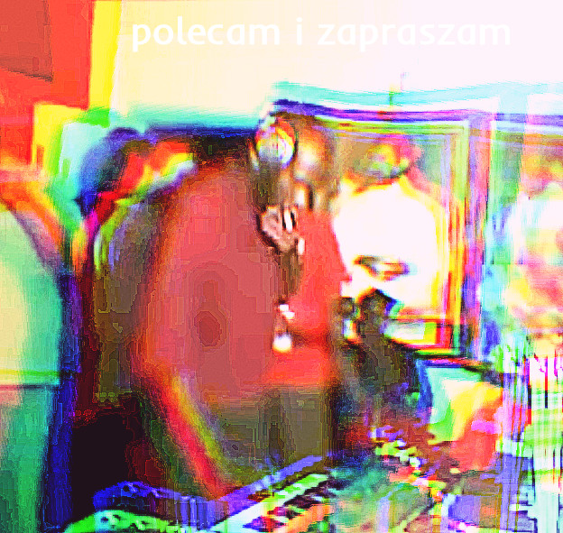

# witaj w opisie playlisty o ɹ o ʇ ʞ ǝ ʅ ǝ na spotify

## [playlista: o ɹ o ʇ ʞ ǝ ʅ ǝ](https://open.spotify.com/playlist/5osJ3Qu77udOEuVLcyG2zV?si=14caa415cdd14622)

## **gatunki albumów/utworów na playliscie (artist - album - [pod]gatunek):**

Special Request - VORTEX - hardcore breaks; podgatunek breakbeat hardcore, troche drum and bass, UK Bass
DJ Seinfeld - Time Spent Away From U - outsider house, acid House; podgatunek house
A2A i inni - A2A - UK Bass, Wonky Techno
Skee Mask - Compro - breakbeat, ambient techno
Fuck Buttons - Slow Focus - progressive electronic, neo-psychodelia, drone
Machinedrum - Room(s) - footwork, UK Bass
Helena Hauff - Qualm - industrial techno, electro, acid techno
Ross from Friends - You'll Understand - outsider house
Jacek Sienkiewicz - Drifting - minimal techno
The Knife - Shaking The Habitual - electronic, post-industrial, experimental
Bodan Raczynski - Rave 'Till You Cry - drill and bass, idm(intelligent dance music hehe)
VTSS/VA - The World of Monnom Black - industrial techno
Autechre - Exai - IDM, experimental, glitch, abstract electronic
Boards of Canada - Geogaddi - IDM, downtempo, ambient techno
De Grandi - 11-100-JAILLE - breakbeat, berite club
Autechre - Move of Ten - IDM, experimental, glitch, abstract electronic
DJ Nigga Fox - Cranio - batida, afro-house, gqom, footwork
Aisha Devi - Of Matter and Spirit - deconstructed club, UK Bass, trance, ritual ambient
Lorenzo Senni/DJ Stingray - XAllegroX - Trance, progressive electronic
Patricia - Several Shades of the Same Colour - Outsider House, Ambient Techno, Dub techno
Muslimgauze - Mullah Said - tribal ambient, ambient dub
Mazutti - Kształt Jazzu Który Ma Dojść - acid techno, industrial techno, acid core
Oneothrix Point Never - R Plus Seven - progressive electronic, vapor, glitch, sound collage
Rezzet - Rezzet LP - outsider house, jungle
Huerco S. - Colonial Patterns - outsider house, ambient house, dub techno
SHX... - Linear S Decoded - dub techno, industrial techno
Abdulla Rashim - A Shell of Speed - ambient techno
Stereolab - Dots And Loops - indietronica, art pop
Squarepusher - Hard Normal Daddy - drill and bass, atmospheric drum and bass
Amon Tobin - Supermodified - nu jazz, electronic, idm
SSTORM - Drenched 9-12 - acid techno
33EMYBW.. - Anthropods - Deconstructed Club, IDM
Flying Lotus - Cosmogramma - idm, glitch hop, wonky
Pekka Airaksinen - Other Power - progressive electronic
Legowelt - Crystal Cult 2080 - acid techno
Lee Gamble - Dutch Tvashar Plumes - minimal techno
DJ Python - Dulce Compania - ambient house, deep house, reggaeton
julek ploski - śpie - Deconstructed Club, glitch
Omar S - Thank You For Letting Me Be Myself - deep house, detroit techno, acid house
ZULI - Terminal - deconstructed club, glitch hop
Zomby - Where Were U In '92 - hardcore breaks, jungle
Lanark Artefax - Whities 011 - idm, uk bass
Machine Girl - Wlfgrl - hardcore breaks, footwork
Death Grips - Government Plates - abstract hip hop, electro industrial, wonky
Hype Williams - Rainbow Edition - hypnagogic pop, electronic
Animal Collective - Merriweather Post Pavillon - neo-psychodelia, electronic
Health - Get Color - electro industrial

## **sposoby odkrywania muzyki:**

- poznawanie innych nagran i projektow wykonawcow ktorych lubimy
- po labelach artystow ktorzy nam sie podobaja
- po gatunkach (im wezszy gatunek tym lepiej), to nie prawda ze nie mozna szufladkowac
- ze stron festiwali, klubow czy wydarzen i koncertow
- z baz danych i ocen ich uzytkownikow (rym, discogs)
- grupki, fora - peje na fb, slizgawka.eu, [4chan /mu](https://boards.4channel.org/mu/thread/48186754) (ostroznie xd)
- spotify - tak sb dziala ale bdb polecanki na bazie playlist albo sledzenie prywatnych kont artystow i blogerow
- sledzenie blogerow muzycznych/ludzi mowiacych o muzyce itp: konkret blog, cukier official yt, boiler room, 
  rumunski spektralizm, rafal zapala, wojtek krzyzanowski
- old school - soulseek, chomikuj (xd), torrenty
- irl - kupowanie ogladanie wymiana nagran, koncerty wydarzenia, rozmowy :D

## **hiperłącza:**

- *klasyk i bdb do odkrywania muzyczki:* [rate your music](https://rateyourmusic.com/)

- *baza z wydawnictw muzycznych, dobra do szukania po wytwórniach:* [discogs](https://www.discogs.com/)

- *dobre do odkrywania wg popularnosci czy skrobli znajomych:* [last fm](http://www.last.fm/home)

- *strona domowa pewnego badacza o ogromnej wiedzy ktory przy okazji przesluchal wiekszosc muzyki:* [piero scaruffi](https://www.scaruffi.com/)

- *do odkrywania nowych artystow:* [bandcamp](https://www.bandcamp.com), [soundcloud](https://www.soundcloud.com), [mixcloud](https://www.mixcloud.com)

## **magazyny o muzyce elektronicznej:**

- [Resident Advisor](https://ra.co/)

- [Fact Magazine](https://www.factmag.com/)

- [XLR8R](https://www.xlr8r.com/)

- [Dummy Magazine](https://www.dummymag.com/)

- [Attack Magazine](https://www.attackmagazine.com/)

- [MixMag](https://mixmag.net/)

**radio internetowe do odkrywania muzyki:**

- [Radio Kapitał](https://radiokapital.pl/)

**polskie festiwale muzyki glownie elektronicznej:**

- [Unsound Festival](https://www.unsound.pl/)
- [Up To Date Festival](https://www.uptodate.pl/)

## **ciekawe labele:**

- **warp records** - aphex twin, bords of canada, autechre, squarepusher, gaika

- **planet mu** - micro ziq, luke vibert, machinedrum

- **hyperdub** - burial, doon kanda, babyfather, foodman

- **ninja tune** - amon tobin, actress, bonobo, helena hauff, octo octa

- **cocoon recordings** - ricardo villalobos, martin buttrich

- **mau5strap recordings** - rezz, blackgummy

- **armada** - erick morillo, anotr

- **hot creations** - patrick topping, richy ahmed

- **defected records** - mele, guti, sam divine

- **innervisions** - ame, peter pardeike

- **dirtybird** - claude vonstroke, j.phillip

- **domino records** - animal collective

## *Pozdrawiam Serdecznie ( ͡° ͜ʖ ͡°)*

<iframe src="https://open.spotify.com/embed/playlist/5osJ3Qu77udOEuVLcyG2zV" width="300" height="380" frameborder="0" allowtransparency="true" allow="encrypted-media"></iframe>
